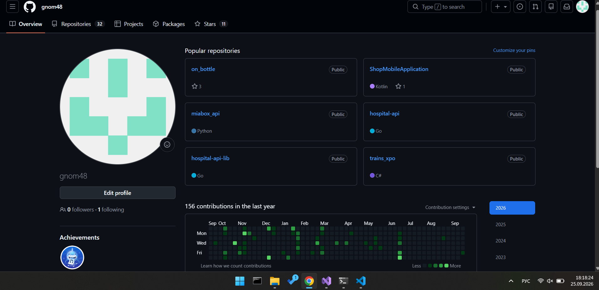
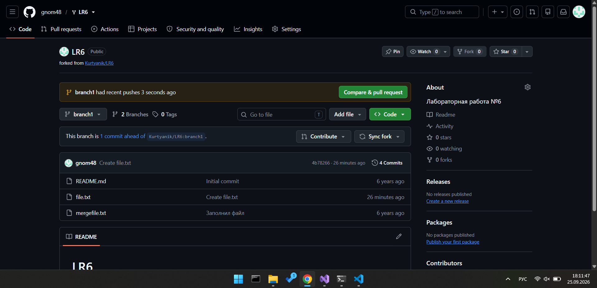
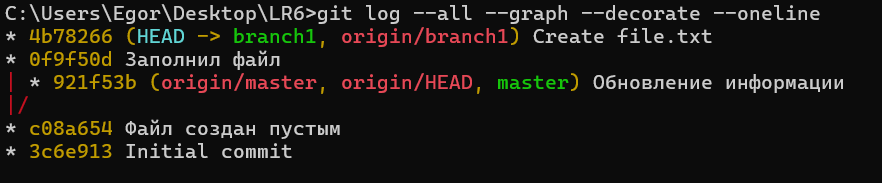

# Лабораторная работа №6

**Выполнил:** студент группы 4517 Иванов Е.С.
**Дата:** 25.09.2026

## Цель работы
изучение базовых возможностей системы управления версиями, опыт работы с Git Api, опыт работы с локальным и удаленным репозиторием.

## Ход работы

### 1. Создание аккаунта на GitHub

Скипаем (аккуант уже был)


### 2. Форк репозитория

Сделана личная копия репозитория
https://github.com/Kurtyanik/LR6/ через кнопку **Fork**.



### 3. Установка и настройка Git

Скипаем (уже стоял)

### 4. Клонирование репозитория
```bash
git clone https://github.com/gnom48/LR6.git
cd LR6
```

### 5. Добавление файла через интерфейс GitHub

Файл `file.txt` создан через кнопку **Add file → Create new file** и закоммичен.
Изменения подтянуты локально:

```bash
git pull origin branch1
```

### 6. История операций
Просмотр истории по всем веткам:

```bash
git log --all --graph --decorate --oneline
```


### 7. Просмотр последних изменений
```bash
git log --stat -n 3
```

8. Слияние с master и разрешение конфликта
```bash
git checkout master
git merge branch1
```
Конфликт разрешён вручную в VS Code, затем:

```bash
git add .
git commit -m "Merge: порешали конфликт"
```

### 9. Удаление побочной ветки
```bash
git branch -d branch1
```

### 10. Несколько коммитов и откат
Серия изменений:

```bash
git add .
git commit -m "Дописали mergefile.txt"
...
git add .
git commit -m "Наследили в file.txt"
```

Откат последнего коммита:

```bash
git reset --hard HEAD~1
```

### 11. Ветка для отчёта
```bash
git checkout -b report
```
